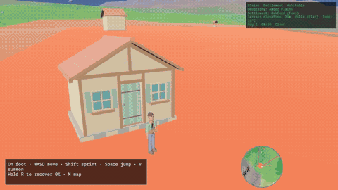
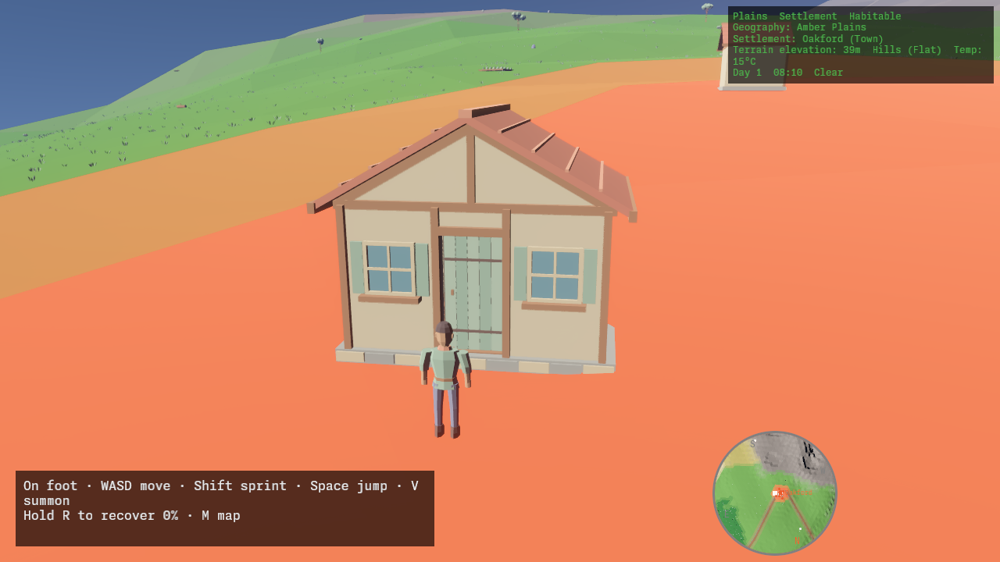
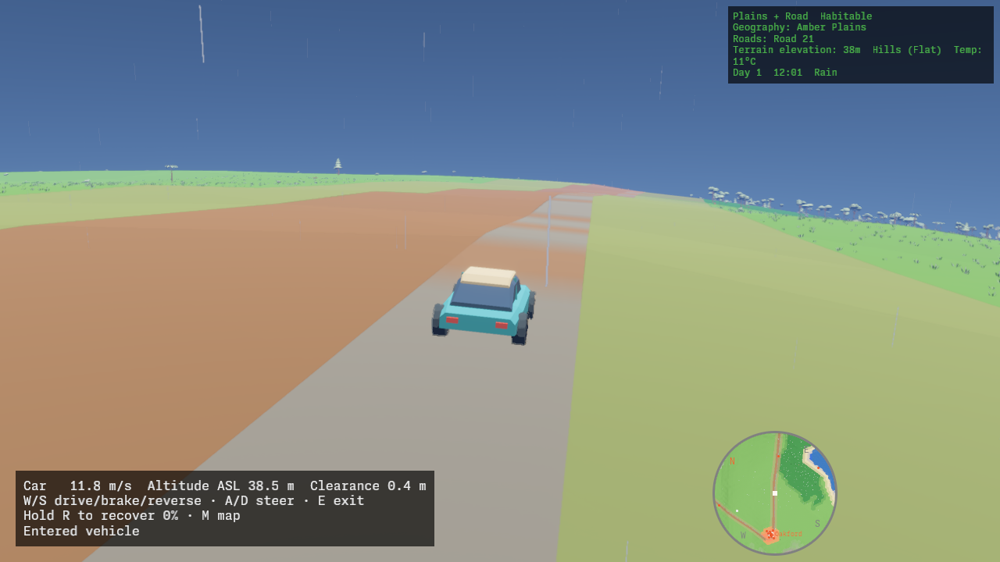
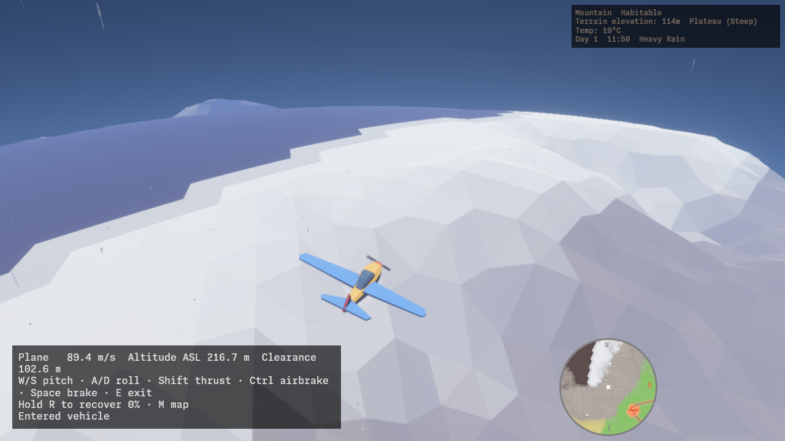
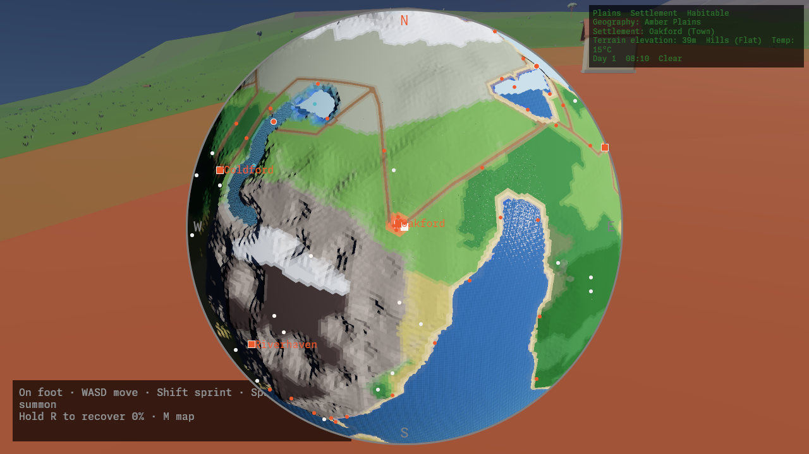

# terra

3D spherical-planet procedural world experiment. Bevy 0.19 + Avian3d physics.

[](docs/media/flight-showcase.mp4)

[Watch the expedition](docs/media/flight-showcase.mp4): leave a house, walk to a car, drive through rain,
then take off over forests, waterways, and snowy mountains. Depart in morning light,
explore and land in daylight, return to the doorstep toward evening, then watch night turn
to morning on the map. The loopable film uses normal gameplay movement, vehicle
physics, and entry/exit controls.


## Screenshots

| Settlements and exploration | Cars and weather |
| --- | --- |
|  |  |

| Mountain flight | Planet view |
| --- | --- |
|  |  |

## Crates

| Crate | Purpose |
|-------|---------|
| `shared` | Library: terrain gen, topology, water, roads, level schema, items, upgrades, theme |
| `gen_assets` | CLI: deterministic Blender MCP asset generator |
| `gen_level` | CLI: precomputes planet-level data to a versioned Postcard binary |
| `main` | Bevy binary: loads precomputed world, chunks terrain/water/scenery/structures, weather, minimap |

## Prerequisites

- Rust 1.99.0 (see `rust-toolchain.toml`)
- `rust-analyzer`, `clippy`
- Python 3, `just`, Blender 5.2.2 LTS with its MCP add-on running (see [asset pipeline](docs/glb-pipeline.md))

## Quickstart

```sh
# Generate GLB models (once, or after changing art definitions)
just assets  # requires running Blender 5.2.2 + MCP add-on

# Precompute the planet (once, or after terrain changes)
cargo run -p gen_level -- crates/main/assets/level_1337.bin

# Run the game
cargo run -p main --release
```

## Offline pipeline

1. `gen_level` precomputes terrain, water, rivers, roads, settlements → `level_{seed}.bin` (embedded via `include_bytes!`)
2. `gen_assets` invokes scripted Blender recipes through MCP, generating 68 meter-scale scenes → `assets/models/production/`
3. `main` loads both at startup, streams the world with 3-LOD chunking

Different seed: `PLANET_SEED=42 cargo run -p gen_level -- crates/main/assets/level_42.bin`

## Verification

```sh
cargo check                    # whole workspace
cargo clippy                   # whole workspace
cargo test -p shared           # shared crate tests
cargo test -p terra-worldgen    # planetary generation and terrain tests
just asset-candidates-test    # Blender export integration tests
cargo test -p gen_assets       # retained baseline generator tests
just assets-check             # production GLB determinism via Blender MCP
cargo bench -p terra-worldgen --bench terrain_gen  # TerrainGen benchmark
cargo bench -p gen_level --bench worldgen    # level gen benchmark
```

## Terrain & Biomes

20 terrain types across land, water, and shore transitions on a 2000 m radius planet. Macro landforms (valley, lowland, hills, mountains up to 500 m, plateau) drive elevation; biomes (desert, plains, forest, tundra, snow, swamp, jungle, savanna, volcanic, glacier) are placed by latitude, moisture, and temperature. Water bodies include ocean up to 200 m depth, freshwater and salt lakes ~140 m mean radius, and rivers with spring sources. Shore transitions: beach, cliff, lake shore, river bank.

Per-face properties: liquid or frozen water phase, normal or frozen surface condition, slope class (flat/gentle/steep/cliff), and water depth (shallow/deep/abyss).

## Geography

- 5 continents + 3 offshore islands per world, targeting ~even land/water split
- 5 mountain ranges, 3 lakes, 6 river routes per world
- 12 settlements connected by one or more road networks (gravel/dirt/sand/rock) with bridge spans (200 m spacing) for water crossings
- Named regions: oceans, lakes, rivers, beaches, cliffs, forests, deserts, mountains, plains, tundra, swamps, jungles, savannas, volcanoes, glaciers, settlements, roads

## Scenery & Structures

27 decorative scenery kinds include plant life (trees, bushes, flowers, grass, cacti, berries, reeds, seaweed, lilypads, kelp, cattails, vines, tumbleweeds, ferns) and nonplants (rocks, logs, mushrooms, dead trees, coral, anemones, starfish, shells, skulls, snowdrifts, stumps, icicles, snowmen).

17 structure kinds (ruins, watchtowers, docks, farms, walls, wells, campfires, tents, crates, fences, barricades, lamp posts, signposts, guardrails, railings, suspension cables, houses)

Both are placed contextually per biome and streamed at 3 LOD levels (960 m / 300 m distances).

## Rendering

Custom WGSL shaders: water with geometric swell, normal-perturbation chop, and analytic depth gradient; foliage with wind-driven vertex sway. TAA with depth + motion-vector prepasses. HDR tonemapping, bloom, and Rayleigh atmosphere.

## Planet view

The heading-up 2D minimap shows nearby terrain and named regions. Press `M` to pull
the live gameplay camera back to a whole-planet view; press `M` or `Esc` to return
to your current explorer or vehicle. Drag to orbit and disengage follow; scroll
to zoom. Press `F` or use **Follow** to track the controlled body again. Camera
travel is interruptible, including while opening or returning.

Click a named marker, ground, or bridge deck to select a destination, then press
`T` to request a safe on-foot teleport. Selection alone does not load collision
or move you. Exit a vehicle before confirming. Closing the view or selecting a
new destination cancels a pending request; successful teleport starts the return
flight. Selection and confirmation become available when the interface is fully
visible. Roads, settlements, regions, and named bridges have independent layer
toggles that persist across reopening.

Movement and physics stay live. World time slows smoothly from full speed nearby
to half speed at whole-planet scale, while camera and interface controls remain
responsive. Rain and snow are hidden in Planet view, and vehicle selection is
unavailable until you return to gameplay. Existing pause and base-speed settings
are preserved. See the
[rendered and performance acceptance record](docs/planet-view-acceptance.md).

## Time & Weather

Day/night cycle with a world sun orbiting the planet's Y axis so the lit hemisphere is day and the far side night. Toggleable sun-lock (`1`) keeps noon overhead permanently.

Dynamic weather: randomized fronts ease a global wind vector and precipitation intensity (rain or snow, resolved per-location by local temperature). 1500-particle camera-anchored pool renders streaks (rain) or flakes (snow), wrapping around the camera. Wind drives water swell, plant sway, and precipitation drift.

## Exploration and vehicles

Walk or sprint across the planet, summon a car or plane on suitable nearby ground,
and enter it with `E`. Vehicles remain where you leave them. Each has its own chase
camera; cars follow terrain pitch and roll, with animated wheels and steering.
Planes have animated propellers, unrestricted rolls and loops, stalls, and speed
changes from climbing and diving. Hold thrust to maintain or build airspeed.

Land and stop before exiting. Terrain, trees, and other solid obstacles can crash
a plane; crashes leave a wreck rather than resetting it. Hold `R` while seated to
restore and reposition the occupied vehicle on safe ground. On foot, recovery
returns the explorer to a safe standing location.

## Assets

The current Blender-generated catalog contains 68 scenes: scenery, settlement
structures, items and weapons, animated actors, and the car and plane. Vehicles
have shaped body panels and contrasting paint colors. Actor clips, equipment sockets,
wheel steering/rotation, and propeller animation use the exported GLB rigs.
See the [asset pipeline](docs/glb-pipeline.md) for generation and validation.

## Controls

| Key | On foot | Car | Plane |
|-----|---------|-----|-------|
| W / S | Walk forward / backward | Accelerate / brake and reverse | Pitch down / up |
| A / D | Turn left / right | Steer left / right | Bank left / right |
| Shift (hold) | Sprint | — | Apply thrust |
| Ctrl (hold) | — | — | Reduce airspeed |
| Space | Jump | — | Ground brake |
| E | Enter nearby vehicle | Exit when stopped | Exit when landed and stopped |
| R (hold 1 second) | Recover explorer | Recover occupied car | Recover occupied plane |

| Key | Shared action |
|-----|---------------|
| V | Open vehicle selector while on foot and outside Planet view; pauses the game |
| C / P | In the selector: summon car / plane |
| Esc | Close vehicle selector |
| M | Toggle live planet view |
| 1 | Toggle sun-lock: sun overhead, or normal day/night cycle |

In Planet view, press M or Esc to return to exploration.
Vehicle summoning and recovery validate clear, dry ground before moving anything.

## Exploration showcase

Run `just flight-showcase` after generating the normal assets and seed-1337 level.
It requires FFmpeg/ffprobe and a working graphics display, renders offscreen, then
saves a 1280×720, 30 fps MP4, an eight-second GIF preview, and four screenshots under
`docs/media/`. Temporary PNG frames are removed after encoding.

For a still every three seconds while validating the journey:

```sh
TERRA_FLIGHT_CAPTURE=/tmp/terra-flight-preview TERRA_FLIGHT_PREVIEW=1 \
  cargo run -p main --features asset-review
```

The development capture follows one connected route using normal gameplay
controls, with a cinematic camera and the normal HUD and minimap. It includes real vehicle
transfers, weather changes, morning departure and evening arrival, an actual landing,
and a physical return approached in the original departure direction.
Uneventful ground travel and straight flight are shortened with selective cuts.
A closing map timelapse advances through night to the opening morning.
Decoded first and last video frames match exactly. See
[the cinematic brief](docs/showcase.md).
The normal game is unaffected when `TERRA_FLIGHT_CAPTURE` is unset.

See [Releases](docs/releases.md) for version tags and the release-please workflow.
